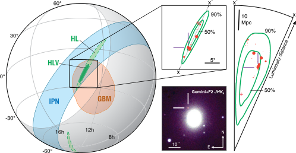

###########
ligo.skymap
###########

The `ligo.skymap` package provides tools for reading, writing, generating, and
visualizing gravitational-wave probability maps from LIGO, Virgo, and KAGRA.
Some of the key features of this package are:

*  Command line tool :doc:`bayestar-localize-coincs
   <tool/bayestar_localize_coincs>`: BAYESTAR, providing rapid,
   coherent, Bayesian, 3D position reconstruction for compact binary
   coalescence events

*  Command line tool :doc:`ligo-skymap-from-samples
   <tool/ligo_skymap_from_samples>`: Create 3D sky maps from
   posterior sample chains using kernel density estimation

*  Command line tool :doc:`ligo-skymap-plot
   <tool/ligo_skymap_plot>`: An everyday tool for plotting HEALPix
   maps

*  Module :mod:`ligo.skymap.plot.allsky`: Astronomical mapmaking tools for
   perfectionists and figure connoisseurs

   This illustration of the position of GW170817, prepared using `ligo.skymap`,
   illustrates the main features of this package: rapid localization of compact
   binaries with BAYESTAR [#BAYESTAR]_, three-dimensional density estimation
   [#GoingTheDistance]_ [#GoingTheDistanceSupplement]_, cross-matching with
   galaxy catalogs, and visualization of gravitational-wave sky maps.
   Reproduced from [#IlluminatingGravitationalWaves]_.

**********************
Quick Start, Tutorials
**********************

.. toctree::
   :maxdepth: 1

   quickstart/install
   help
   contributing
   quickstart/bayestar-injections
   performance

*******
Modules
*******

Coordinate Frames (`ligo.skymap.coordinates`)
---------------------------------------------

.. toctree::
   :maxdepth: 1

   coordinates/detector
   coordinates/eigenframe

I/O and Data Format Support (`ligo.skymap.io`)
----------------------------------------------

.. toctree::
   :maxdepth: 1

   io/events
   io/fits
   io/hdf5

Plotting and Visualization (`ligo.skymap.plot`)
-----------------------------------------------

.. toctree::
   :maxdepth: 1

   plot/allsky
   plot/backdrop
   plot/bayes_factor
   plot/marker
   plot/poly
   plot/pp

Sky Map Postprocessing (`ligo.skymap.postprocess`)
--------------------------------------------------

.. toctree::
   :maxdepth: 1

   postprocess/contour
   postprocess/cosmology
   postprocess/crossmatch
   postprocess/ellipse
   postprocess/util

Localization
------------

.. toctree::
   :maxdepth: 1

   bayestar/index
   bayestar/ez_emcee
   distance/index
   healpix_tree/index
   kde/index
   moc/index

Utilities
---------

.. toctree::
   :maxdepth: 1

   util/file
   util/ilwd
   util/numpy
   util/sqlite
   tool/index

******************
Command Line Tools
******************

BAYESTAR Rapid Sky Localization
-------------------------------

.. toctree::
   :maxdepth: 1

   tool/bayestar_localize_coincs
   tool/bayestar_localize_lvalert
   tool/bayestar_mcmc
   tool/bayestar_realize_coincs
   tool/bayestar_sample_model_psd
   tool/bayestar_inject

Sky Map Visualization
---------------------

.. toctree::
   :maxdepth: 1

   tool/ligo_skymap_contour
   tool/ligo_skymap_contour_moc
   tool/ligo_skymap_plot
   tool/ligo_skymap_plot_airmass
   tool/ligo_skymap_plot_coherence
   tool/ligo_skymap_plot_observability
   tool/ligo_skymap_plot_volume

Postprocessing
--------------

.. toctree::
   :maxdepth: 1

   tool/ligo_skymap_combine
   tool/ligo_skymap_constellations
   tool/ligo_skymap_from_samples
   tool/ligo_skymap_plot_stats
   tool/ligo_skymap_stats
   tool/ligo_skymap_flatten
   tool/ligo_skymap_unflatten

**************
Developer Info
**************

.. toctree::
   :maxdepth: 1

   changes
   develop
   testing
   interface
   GitLab Project Page <https://git.ligo.org/lscsoft/ligo.skymap>
   GitHub Mirror <https://github.com/lpsinger/ligo.skymap>
   Python Package Index <https://pypi.org/project/ligo.skymap>

*****
Index
*****

* :ref:`genindex`
* :ref:`modindex`
* :ref:`search`

**********
References
**********

.. [#BAYESTAR]
   Singer, L. P., & Price, L. R. 2016, *Phys. Rev. D*, 93, 024013.
   :doi:`10.1103/PhysRevD.93.024013`

.. [#GoingTheDistance]
   Singer, L. P., Chen, H.-Y., Holz, D. E., et al. 2016, *Astropys. J. Lett.*,
   829, L15. :doi:`10.3847/2041-8205/829/1/L15`

.. [#GoingTheDistanceSupplement]
   Singer, L. P., Chen, H.-Y., Holz, D. E., et al. 2016, *Astropys. J. Supp.*,
   226, 10. :doi:`10.3847/0067-0049/226/1/10`

.. [#IlluminatingGravitationalWaves]
   Kasliwal, M. M., Nakar, E., Singer, L. P. et al. 2019, *Science*, 358, 1559.
   :doi:`10.1126/science.aap9455`
