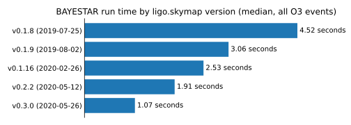

How fast is BAYESTAR?
=====================

In order to achieve the lowest possible latency for real-time observations,
BAYESTAR is optimized to use `instruction-level parallelism`_ on modern x86_64
processors and thread-level parallelism via `OpenMP`_ to scale up to systems
with up to tens or hundreds of cores.

The plot below shows the median run time of BAYESTAR, averaged over all O3
events, for a few selected recent version of ligo.skymap. Code optimizations
between 2019 and 2020 resulted in a speedup by almost a factor of 5.

These benchmarks were collected on a `Dell PowerEdge C6420`_ system with two
`Intel® Xeon® Gold 6136 @ 3.00GHz`_ CPUs and hyperthreading enabled, for 48
hardware threads. This is the same hardware configuration on which BAYESTAR was
deployed for online LIGO/Virgo alerts during Advanced LIGO and Virgo's third
observing run (O3).

.. _`instruction-level parallelism`: https://en.wikipedia.org/wiki/Advanced_Vector_Extensions
.. _`OpenMP`: https://www.openmp.org
.. _`Dell PowerEdge C6420`: https://www.dell.com/en-us/work/shop/povw/poweredge-c6420
.. _`Intel® Xeon® Gold 6136 @ 3.00GHz`: https://ark.intel.com/content/www/us/en/ark/products/120479/intel-xeon-gold-6136-processor-24-75m-cache-3-00-ghz.html
